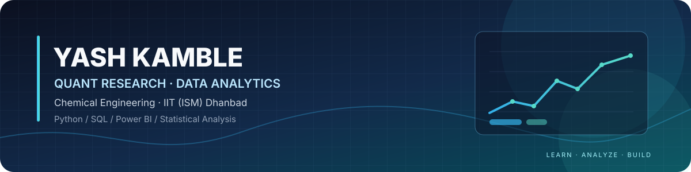

<!-- Profile README for 23je0449-cloud -->

  
   
  
   
  
  

---

## 👋 Hey, I'm Yash Kamble

🎓 **Chemical Engineering undergraduate at IIT (ISM) Dhanbad** (expected May 2027) with a growing focus on **quantitative research, data analytics, and visualization**. I enjoy exploring datasets, testing ideas, and translating analysis into clear, practical insights.

- 📊 **Research:** Research Consultant Intern at **WorldQuant** — developing and evaluating quantitative signals using historical market data.
- 🧠 **Analytics:** Exploratory data analysis, data cleaning, KPI reporting, and dashboarding.
- 🧰 **Tools:** Python, SQL, Pandas, NumPy, Matplotlib, Seaborn, Power BI, DAX, Power Query, Excel, and SQLite.
- 🧪 **Engineering:** Chemical process fundamentals and Aspen Plus process simulation.
- 🎬 **Leadership & creativity:** Senior videographer/editor with LightsCameraISM; helped lead a team of 25+ across college fests and events.

## 💼 Experience Snapshot

### Quantitative Research Consultant Intern — WorldQuant
*Nov 2025 – Present · Remote*

- Developed **50+ alpha signals** using **50+ datasets**.
- Reported average alpha fitness above **1.8**, while considering turnover and drawdown.
- Evaluated signal quality using fitness, Sharpe ratio, turnover, drawdown, and systematic backtesting.
- Applied statistical analysis and historical market data to test quantitative hypotheses.

## 🚀 Featured Projects

<table>
  <tr>
    <td width="50%" valign="top">
      <h3>📈 FinanceIQ — Financial Analytics Dashboard</h3>
      
Interactive Power BI dashboard for financial performance, customer behavior, transaction trends, and KPI reporting.

      
<strong>Tools:</strong> Power BI · Power Query · DAX

      <a href="https://github.com/23je0449-cloud/-FinanceIQ-Dashboard">View repository →</a>
    </td>
    <td width="50%" valign="top">
      <h3>🧩 Customer Churn Prediction</h3>
      
Data-focused project exploring customer data and patterns relevant to churn analysis.

      
<strong>Tools:</strong> Python · Pandas · Data Analysis

      <a href="https://github.com/23je0449-cloud/Customer-Churn-Prediction">View repository →</a>
    </td>
  </tr>
  <tr>
    <td width="50%" valign="top">
      <h3>🧪 Aspen Syngas Simulation</h3>
      
Chemical engineering process simulation exploring syngas/hydrogen production and stream analysis.

      
<strong>Tools:</strong> Aspen Plus · Process Simulation

      <a href="https://github.com/23je0449-cloud/yash-kamble-Aspen-Syngas-Simulation">View repository →</a>
    </td>
    <td width="50%" valign="top">
      <h3>🐍 CODSOFT Tasks</h3>
      
A collection of task-based programming and data analysis work. Check the repository for individual deliverables.

      
<strong>Tools:</strong> Python · Jupyter Notebook

      <a href="https://github.com/23je0449-cloud/-CODSOFT_TASKSNO">View repository →</a>
    </td>
  </tr>
</table>

## 🛠️ Tech Stack

  
    
  
  
  
  
  
  
  
  

## 🏅 Highlights

- Completed **The Ultimate Job Ready Data Science Course** by CodeWithHarry.
- Completed Tata/Forage **Data Visualisation: Empowering Business with Effective Insights** virtual experience.
- Participated in **Survival of Chemist 3.0** at Concetto, IIT (ISM) Dhanbad.
- Helped lead a team of **25+** as Senior Videographer and Editor at LightsCameraISM, supporting 5+ college fests and 10+ events.
- Supported event organization for **Concetto'24** and **Srijan'24**.

## 📊 GitHub at a Glance

  
  
   
  

## 🤝 Let's Connect

I'm interested in opportunities and conversations around **quantitative research, data analytics, business intelligence, and data-driven engineering**.

- 💼 [LinkedIn](https://www.linkedin.com/in/yash-kamble-b92661287/)
- 🧑‍💻 [Explore my repositories](https://github.com/23je0449-cloud?tab=repositories)

  “Curious by nature. Analytical by approach. Always learning.”

---